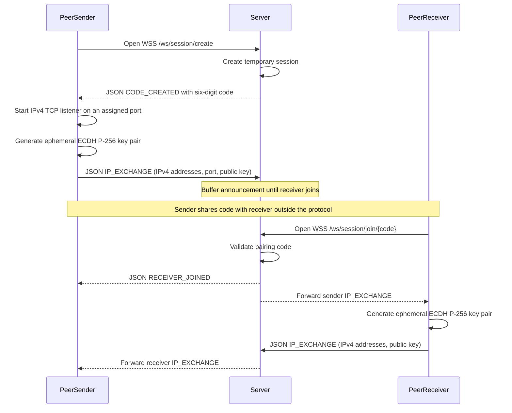
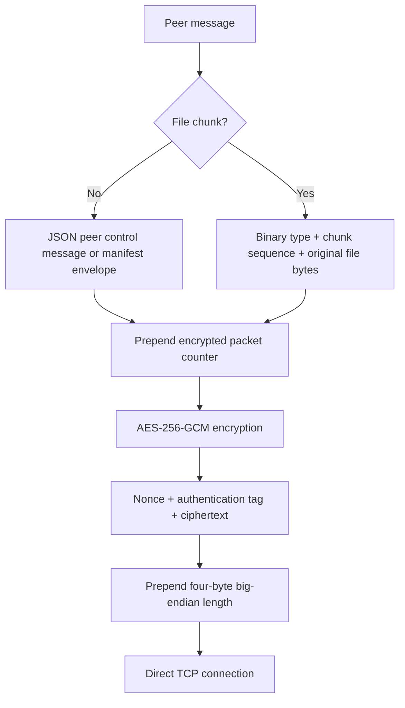
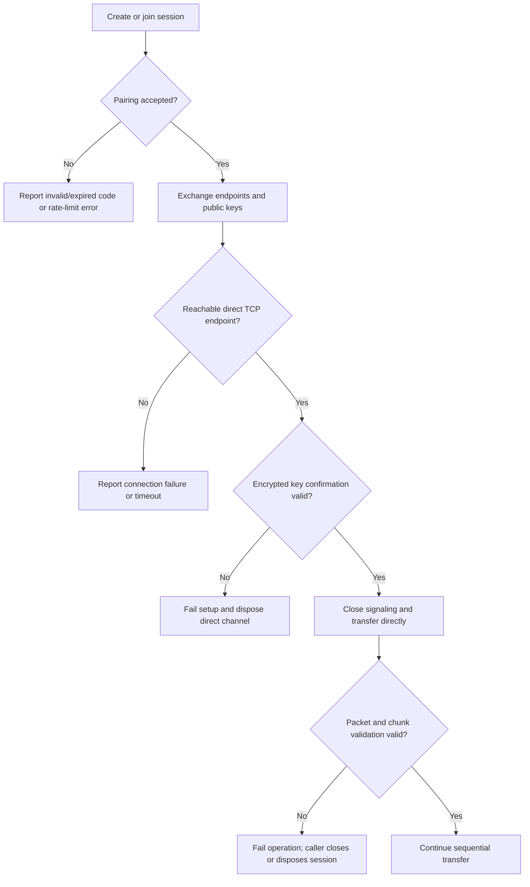

# Peer transfer flows

This document describes the current session-based flow used by `PifeonServer`,
with three actors:

- **Server:** creates temporary pairing sessions and forwards endpoint/public-key announcements.
- **PeerSender:** owns the source files and listens for a direct TCP connection.
- **PeerReceiver:** joins with the pairing code and connects to the sender.

GitHub renders the diagrams below natively from fenced `mermaid` blocks.
See [GitHub's Mermaid documentation](https://docs.github.com/en/get-started/writing-on-github/working-with-advanced-formatting/creating-diagrams#creating-mermaid-diagrams).
Other Markdown viewers may require Mermaid support or show the diagram source instead.

## 1. Pairing and endpoint exchange



Creating/joining a session is selected by the WebSocket URL; clients do not need
an additional `CREATE` or `JOIN` message after opening that connection.

Both peers announce their local IPv4 addresses and public keys. Only the sender
advertises a listening TCP port; the receiver announces port `0` because it
initiates the direct connection rather than accepting one.

`RECEIVER_JOINED` means the server has paired the clients. It does **not** mean
that direct communication or cryptographic key confirmation has succeeded.

## 2. Secure direct connection and signaling shutdown

```mermaid
sequenceDiagram
    participant S as PeerSender
    participant H as Server
    participant R as PeerReceiver

    S->>S: Validate receiver P-256 public key
    R->>R: Validate sender P-256 public key
    S->>S: ECDH shared secret, then directional HKDF keys
    R->>R: ECDH shared secret, then directional HKDF keys
    R->>S: Connect to reachable advertised IPv4 TCP endpoint
    S-->>R: Accept direct connection
    par Sender key confirmation
        S->>R: Encrypted JSON Handshake (sender-ready)
    and Receiver key confirmation
        R->>S: Encrypted JSON Handshake (receiver-ready)
    end
    S->>S: Decrypt and validate receiver confirmation
    R->>R: Decrypt and validate sender confirmation
    par Close sender signaling
        S->>H: Close WebSocket signaling
    and Close receiver signaling
        R->>H: Close WebSocket signaling
    end
    H->>H: Remove pairing session
    Note over S,R: Peer connection is ready; direct TCP remains open
```

- ECDH uses ephemeral **NIST P-256** keys.
- HKDF-SHA256 derives separate sender-to-receiver and receiver-to-sender
  **256-bit keys**, using the session code as salt and distinct direction labels.
- The existing AES-GCM helper encrypts and authenticates every peer packet,
  including handshake, manifest, file chunks, and acknowledgments.
- Both peers confirm possession of the derived keys before the session reports
  a successful connection.
- Signaling closes automatically after confirmation. This does not close the
  independent TCP connection.
- Explicit session `CloseAsync` or disposal closes the peer connection and any
  remaining signaling connection.

The five-minute pairing timeout no longer limits the duration of a successfully
established file transfer.

## 3. Manifest and sequential file transfer

```mermaid
sequenceDiagram
    participant S as PeerSender
    participant R as PeerReceiver

    S->>S: Scan source file or folder
    S->>S: Wait for confirmed direct connection
    S->>R: Encrypted JSON Manifest
    R->>R: Validate file counts and sizes
    loop Each file in manifest order
        R->>R: Validate destination path and create file
        loop Each chunk, up to 64 KiB
            S->>R: Encrypted binary ChunkData (sequence, original bytes)
            R->>R: Validate sequence and size, then write bytes
            R->>R: Report receive progress
            R-->>S: Encrypted JSON ChunkAck (same sequence)
            S->>S: Validate acknowledgment and report send progress
        end
    end
    Note over S,R: Transfer completes using manifest sizes; no separate completion message
    Note over S,R: Caller closes or disposes the session when finished
```

The server is **not** part of this phase: neither the manifest nor file bytes
travel through it.

### Manifest contents

The JSON manifest contains:

| Field | Meaning |
| --- | --- |
| `totalFiles` | Number of files |
| `totalSizeBytes` | Sum of all file sizes |
| `items[].relativePath` | File path relative to the source folder, or the source file name |
| `items[].fileSize` | File size in bytes |

The scanner computes hashes locally, but the current manifest does not transmit
them and the receiver does not perform a post-transfer hash comparison.
AES-GCM verifies the authenticity of packets in transit.

### File boundaries and acknowledgments

- Files are transferred **one at a time**, in manifest order.
- Chunk sequence numbers start at `1` and increase across all files in the transfer.
- The sender waits for a matching acknowledgment before sending the next chunk.
- The receiver uses each manifest file size to determine its boundary; there
  are no separate file-start or file-end messages.
- Empty files are created without any chunk messages.
- An acknowledgment confirms that the chunk was written to the file stream,
  not that it was durably flushed to disk.

## 4. Serialization and packet layout



| Layer | Layout |
| --- | --- |
| Signaling | JSON over WSS; public keys may be base64-encoded as JSON byte fields |
| Peer control | JSON `PeerNetworkMessage`; the manifest payload contains JSON manifest bytes |
| File chunk before encryption | Type: 1 byte; chunk sequence: 8 bytes, big-endian; raw file data: 1 to 65,536 bytes |
| Encrypted plaintext | Packet counter: 8 bytes, big-endian; then the peer message |
| AES-GCM package | Nonce: 12 bytes; authentication tag: 16 bytes; then ciphertext |
| TCP frame | Length: 4 bytes, big-endian; then the AES-GCM package |

The file bytes are **never JSON-serialized or base64-encoded**. Encryption
changes their wire representation to ciphertext, but they remain binary data.
JSON control envelopes can encode their byte payload fields as base64; this
does not apply to the binary `ChunkData` format.

The encrypted packet counter is separate from the file chunk sequence:
it covers every packet in each direction, including control messages, and
rejects replayed or out-of-order packets. TCP framing assembles complete
messages and rejects invalid lengths; its maximum packet size is 4 MiB.
WebSocket signaling messages are assembled across fragments and limited to 64 KiB.

## 5. Failure flow and current limits



- **Network scope:** IPv4 LAN/reachable endpoints. The sender must allow inbound
  TCP on its assigned listening port.
- **No automatic NAT traversal:** the UDP STUN helper is not used to advertise
  a TCP endpoint. ICE/WebRTC, port mapping, and server-relay fallback are not
  implemented.
- **Bounded connection attempts:** after endpoint exchange, direct connection
  and key confirmation have a 30-second budget; each receiver endpoint attempt
  has a three-second timeout, subject to that overall budget.
- **Signaling trust:** the standard client requires `wss://` with trusted
  certificate validation for remote servers. `ws://` is permitted only for
  loopback development. Custom injected transports must provide their own
  trusted signaling channel.
- **Authentication model:** the signaling server is trusted to deliver the
  correct public keys. A malicious or compromised server can substitute keys;
  independent fingerprint verification is not implemented.
- **Pairing code:** six digits identify a temporary session, not an encryption
  key or proof of a human identity.
- **Transfer errors:** authentication failures, wrong chunk/ack sequences,
  invalid sizes, and invalid destination paths raise errors rather than
  continuing with corrupted data.
- **No resume or rollback:** automatic reconnect/resume, durable completion
  acknowledgment, and cleanup of partially received files are not implemented.

## Implementation references

- [Client entry point](../src/Pifeon.Core/PifeonServer.cs)
- [Session lifecycle](../src/Pifeon.Core/Services/PifeonSession.cs)
- [Direct connection and key confirmation](../src/Pifeon.Core/Networking/DirectPeerMessageChannel.cs)
- [Peer message serialization](../src/Pifeon.Core/Networking/PeerMessageChannel.cs)
- [Encrypted transport](../src/Pifeon.Core/Networking/EncryptedTransportChannel.cs)
- [TCP framing](../src/Pifeon.Core/Networking/TcpTransportChannel.cs)
- [Sender](../src/Pifeon.Core/Services/PifeonSender.cs)
- [Receiver](../src/Pifeon.Core/Services/PifeonReceiver.cs)
- [Server signaling handler](../src/Pifeon.Server/WebSocketHandler.cs)

## Test coverage

- [Client flow integration tests](../tests/Pifeon.IntegrationTests/PifeonClientFlowTests.cs)
  exercise the public client API against a real loopback Kestrel server and direct
  TCP peers: pairing, notification, signaling-session removal, folder contents,
  large manifests, empty files, exact chunk progress, and compatibility entry points.
- [Server integration tests](../tests/Pifeon.IntegrationTests/ServerTests.cs)
  cover endpoint/public-key forwarding, fragmented signaling, invalid/expired
  codes, rate limits, and rejection of non-JSON or oversized signaling messages.
- [Session unit tests](../tests/Pifeon.Tests/CoreTests/PifeonSessionTests.cs)
  use cancellation-aware message queues to distinguish pairing from confirmed
  direct connectivity and verify resource ownership and cancellation.
- [Sender tests](../tests/Pifeon.Tests/CoreTests/PifeonSenderTests.cs) and
  [receiver tests](../tests/Pifeon.Tests/CoreTests/PifeonReceiverTests.cs)
  verify chunk boundaries, acknowledgment sequencing, metadata validation,
  destination paths, and progress using isolated temporary directories.
- [Secure transport tests](../tests/Pifeon.Tests/CoreTests/SecurePeerTransportTests.cs)
  verify binary file framing, ECDH/AES-GCM round trips, tampering/replay rejection,
  directional/session key separation, TCP fragmentation, and unreachable endpoints.

Legacy signaling and standalone STUN/P2P helper tests remain separate; they do
not establish that the standard client performs NAT traversal or server-relayed
file transfer.
